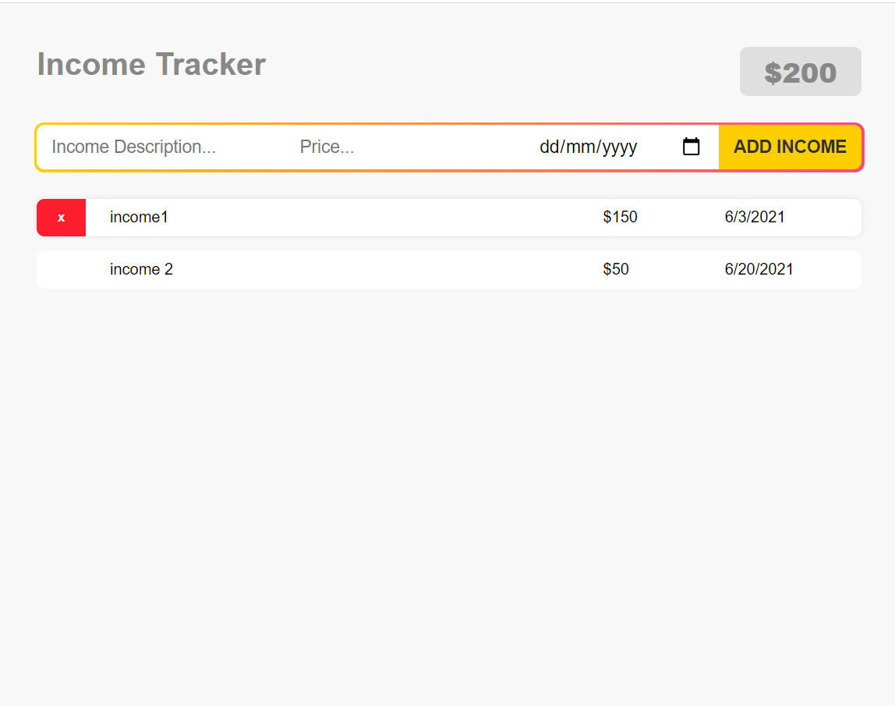

<h1>Income Tracker Using React</h1>

Used React components, React hooks such as; useState, useRef and useEffect. Used array map and sort to list and sort the income items.

<h2>The Published Income Tracker App:</h2>

https://justjd04.github.io/income-tracker-react/

<h2>Commands to create-react-app:</h2>

npx create-react-app income-tracker-react

cd income-tracker-react

code .

npm start

<!--
src
remove app.test.js, setupTest.js App.css, logo.svg, serviceWorker/reportWebVitals

App.js
remove logo and app.css

index.js
remove import serviceWorker/reportWebVitals
remove reportWebVitals function below with comment

App.js
import React, { useState, useEffect } from 'react';

all components in components folder
create components/Header.js

App.js
import Header from './components/Header';

Header.js
rfce
don't forget semicolon end of import and export

Header component is complete
create another component under components folder
-->

<h2>Commands used to publish react files in github:</h2>

Go to package.json

Add:"homepage": "https://justjd04.github.io/income-tracker-react",

Format:https://UserName.github.io/Project-name

Under scripts

Add:

"predeploy": "npm run build",

"deploy": "gh-pages -d build",

cmd:

git remote add origin https://justjd04.github.io/income-tracker-react

git remote set-url origin https://justjd04.github.io/income-tracker-react

npm run build

npm run deploy

(ERR! gh-pages is not recognized Solution:npm install gh-pages --save-dev)

<h2>Push using Git Bash:</h2>

cd income-tracker-react

git remote add origin https://github.com/justjd04/income-tracker-react.git

git remote

git status

git add .

git commit -m "initial commit"

git push -u origin master

